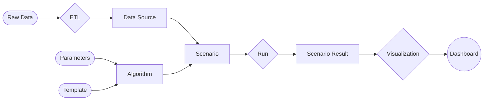

# Architecture

## Overview
The Algomancy framework is a web-based application for the analysis and visualization of complex analytical scenarios. It is designed to be flexible and extensible, enabling users to implement their own algorithms and data processes.

## Design goals
The following design goals were chosen to guide the development of the framework

### Robust and reliable
The framework is designed with a strong emphasis on robustness, reliability, and flexibility. Its modular backend architecture divides the system into smaller, manageable components, making development and maintenance straightforward. Leveraging the mature Dash framework for the frontend ensures extensibility and ease of customization, while integrated logging facilitates effective debugging and monitoring.

### Customizable backend
A key design goal is to provide a customizable backend. Users are encouraged to implement their own algorithms and data sources, allowing the framework to support a wide range of applications without being limited to a specific use case. For more advanced requirements, users can extend the standard classes, using the framework as a library and tailoring its core functionality to their needs.

### Minimize boiler plate code
The framework is designed to minimize the amount of boilerplate code required to implement a new algorithm or data source. This approach ensures that users can focus on the core logic of their application, while the framework handles the details of data management, processing, and visualization.

### Case-dependent frontend
The frontend is intentionally case-dependent, offering only the scaffolding dictated by the backend architecture. It is designed for easy extension, enabling users to supply functions that render page content and define custom callback functions for interactive elements. This approach ensures a highly flexible and customizable frontend, empowering developers to focus on creating visualizations specific to their scenarios.

### Single-responsibility principle
Adhering to the single-responsibility principle, the framework breaks down requirements into distinct components, each with a clear and focused purpose. This structure enhances code clarity, simplifies testing, and improves maintainability.

## Backend architecture
The backend of the framework is structured around a clear conceptual model, ensuring both extensibility and maintainability. At its core, the model consists of three primary components: `DataSource`, `Algorithm`, and `Scenario`. Each plays a distinct role in representing, processing, and analyzing data within the system.
The following diagram illustrates the overall architecture:

### DataSource: Managing Raw Data
A `DataSource` serves as the foundation for any scenario, encapsulating the raw data required to describe a physical or logical situation. Typically, this data is aggregated from multiple files through an Extract, Transform, Load (ETL) process, which standardizes and prepares the information for further analysis. To optimize performance, the framework supports serialization and deserialization of data sources to and from JSON, significantly reducing loading times for large datasets. Additionally, the `DataSource` component is designed to be extensible, allowing developers to implement object-oriented data models tailored to their specific domain requirements.

Often times, deciding where to draw the line between _data transformation_ and _decision-making_ is not a black and white issue. There may be several ways to achieve the same end-goal, none of which are strictly enforced or prohibited by the framework. We feel that this is an important design decision that has a significant impact on the long-term maintainability of a project.  We aim to stick to the line below:
> A DataSource should **define** the world, in which one is trying to solve a problem. It should **not** contain any logic about **how** to solve the problem.

### Algorithm: Transforming Data into Results
The `Algorithm` component defines the logic that processes a `DataSource` and produces a `ScenarioResult`. This transformation can range from straightforward business rule evaluations to sophisticated decision-making procedures. Depending on the use case, an algorithm might be implemented directly within the framework or act as an interface to external services, such as optimization solvers or machine learning models. This flexibility enables users to address a wide variety of analytical challenges, ensuring that the framework remains adaptable to evolving needs.

### Scenario: Combining Data and Logic
A `Scenario` represents a unique combination of a `DataSource` and an `Algorithm`. It encapsulates both the input data and the processing logic, allowing users to execute analyses and generate visualizations based on the results. Scenarios can be run independently or in parallel, facilitating direct comparison between different approaches or datasets. The framework provides mechanisms for scenario comparison, where two scenarios are executed simultaneously and their results are evaluated side by side. Visualization of these results is left to the user, who can implement custom views to best communicate the insights derived from each scenario.

This architecture ensures that each component has a well-defined responsibility, promoting clarity and ease of extension. By separating data management, processing logic, and scenario execution, the framework supports robust development practices and enables users to build complex analytical workflows with confidence.

## Frontend architecture
The frontend architecture is organized into several pages:
- The data page allows users to import, export, view, and manipulate underlying data.
- The scenario page combines data with algorithms to create scenarios, execute them, and visualize results.
- The compare page enables side-by-side comparison of two scenarios.
- The overview page provides a summary of all scenarios.

## Features and limitations
- Data import/export, through ETL as well as Serialized files
- Scenario creation and execution
- Side-by-side scenario comparison
- Asyncronous running of scenarios, with progress tracking
- Extensive logging 
- Basic authentication

## Limitations
- Comparison of exactly two scenarios only
- No support for multiple users

## Roadmap
- A library of re-usable visualziation components
- Loading/saving of completed scenarios

